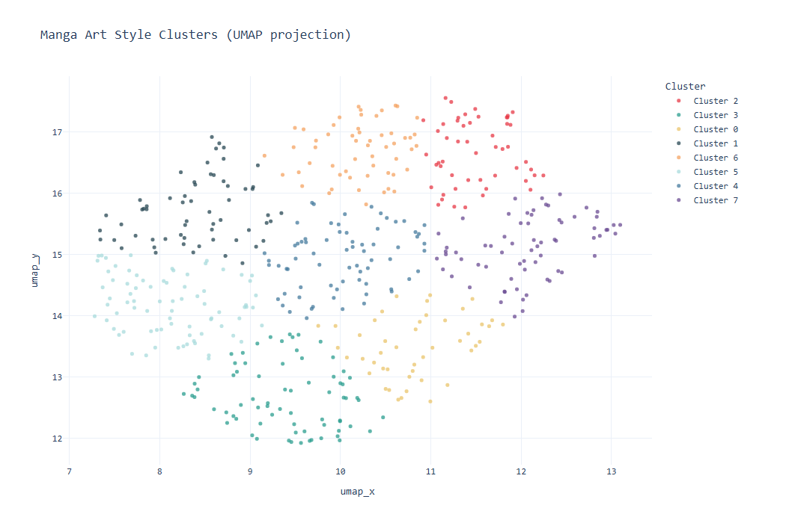
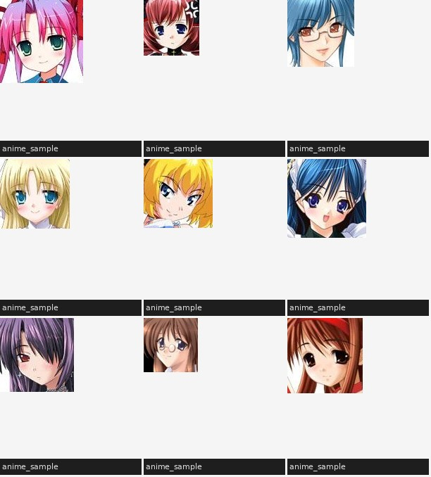

# Anime Art Style Clustering

Unsupervised clustering of anime faces by visual style using CNN feature extraction and UMAP dimensionality reduction.



---

## Overview

Can a model learn to group anime illustrations by art style without ever being told what "style" means?

This project answers that by building an end to end unsupervised pipeline:

1. Extract deep visual features from anime face images using a pretrained ResNet50
2. Compress 2048-dim embeddings down to 2D with PCA + UMAP
3. Cluster images by style using KMeans
4. Visualize the results as an interactive scatter plot

The model surfaces genuinely meaningful style groupings faces with similar shading, line weight, and proportions cluster together, with no labels required.

---

## Results

Running on 500 anime face images, KMeans (k=8) produced a silhouette score of **0.37**, with clusters visually separating by:

- Shading style (cel-shaded vs soft gradient)
- Line weight and detail density
- Face proportions and eye style
- Overall brightness and color palette

Sample cluster grid:



---

## Pipeline

```
Raw images
  ResNet50 feature extraction     (2048-dim embeddings)
  PCA compression                 (2048 → 50 dims)
  UMAP projection                 (50 → 2 dims)
  KMeans clustering               (k=8)
  Interactive Plotly visualization
```

---

## Tech Stack

| Component                | Tool                                               |
| ------------------------ | -------------------------------------------------- |
| CNN feature extraction   | PyTorch + torchvision (ResNet50, ImageNet weights) |
| Dimensionality reduction | scikit-learn (PCA), umap-learn                     |
| Clustering               | scikit-learn (KMeans)                              |
| Visualization            | Plotly, Pillow                                     |
| Data                     | Anime Face Dataset (Kaggle)                        |

---

## Setup & Usage

```bash
# 1. Clone the repo
git clone https://github.com/yourusername/anime-style-clustering
cd anime-style-clustering

# 2. Create and activate virtual environment
python3 -m venv venv
source venv/bin/activate

# 3. Install dependencies
pip install -r requirements.txt

# 4. Add images to data/anime_sample/ then run the pipeline
python3 prepare_data.py
python3 2_extract_features.py
python3 3_cluster.py
python3 4_visualize.py

# 5. Open the interactive visualization
open outputs/cluster_map.html
```

---

## Key Concepts Demonstrated

- **Transfer learning** repurposing a ResNet50 trained on ImageNet as a general-purpose visual feature extractor, without any retraining
- **Dimensionality reduction** chaining PCA and UMAP to compress 2048-dim vectors into a 2D space that preserves structure
- **Unsupervised clustering** using KMeans to discover natural groupings with no labeled data
- **End-to-end ML pipeline** data preparation, feature engineering, modeling, and visualization as a complete system

---

## Potential Improvements

- Swap ResNet50 for CLIP or an illustration-specific model for richer style features
- Scale dataset to 5000+ images across multiple anime series
- Try DBSCAN to auto-detect the number of clusters
- Fine-tune the CNN on an anime classification task before extracting embeddings
- Add thumbnail previews on hover in the interactive scatter plot
